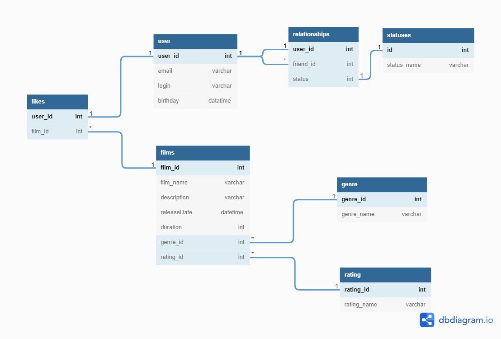

# Схема базы данных

### Пример запроса
* Получение общих друзей для пользователя с id =1 :
> SELECT FRIEND_ID 
FROM RELATIONSHIP 
WHERE USER_ID=1
    INTERSECT
SELECT FRIEND_ID 
FROM RELATIONSHIP 
WHERE USER_ID=1
