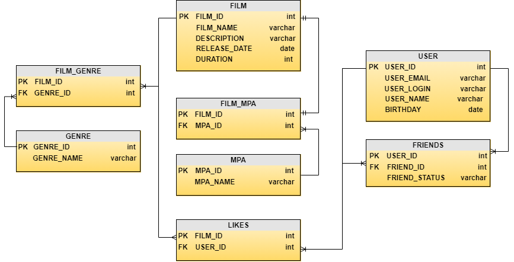

#Java-Filmorate

Filmorate project 2.0
New functions:
- adding and deleting friends
- adding and deleting likes
- getting films by rating 

**DataBase Visualisation**
  
  
**10 Most Popular Films**  
SELECT f.FILM_NAME, COUNT(*) AS LIKES  
FROM FILM f  
INNER JOIN LIKES l ON f.FILM_ID = l.FILM_ID  
GROUP BY f.FILM_NAME  
ORDER BY LIKES DESC  
LIMIT 10;  
  
**Get Common Friends**  
SELECT f1.FRIEND_ID  
FROM FRIENDS f1  
INNER JOIN FRIENDS f2 ON f1.FRIEND_ID = f2.FRIEND_ID  
WHERE f1.USER_ID = user1_id AND f2.USER_ID = user2_id  
AND f1.FRIEND_STATUS = 'ПОДТВЕРЖДЕННЫЙ' AND f2.FRIEND_STATUS = 'ПОДТВЕРЖДЕННЫЙ'  
  
**Most Popular Genre**  
SELECT g.GENRE_NAME, COUNT(l.USER_ID) AS num_likes  
FROM FILM_GENRE fg  
JOIN GENRE g ON fg.GENRE_ID = g.GENRE_ID  
JOIN LIKES l ON fg.FILM_ID = l.FILM_ID  
GROUP BY g.GENRE_NAME  
ORDER BY num_likes DESC  
LIMIT 1;